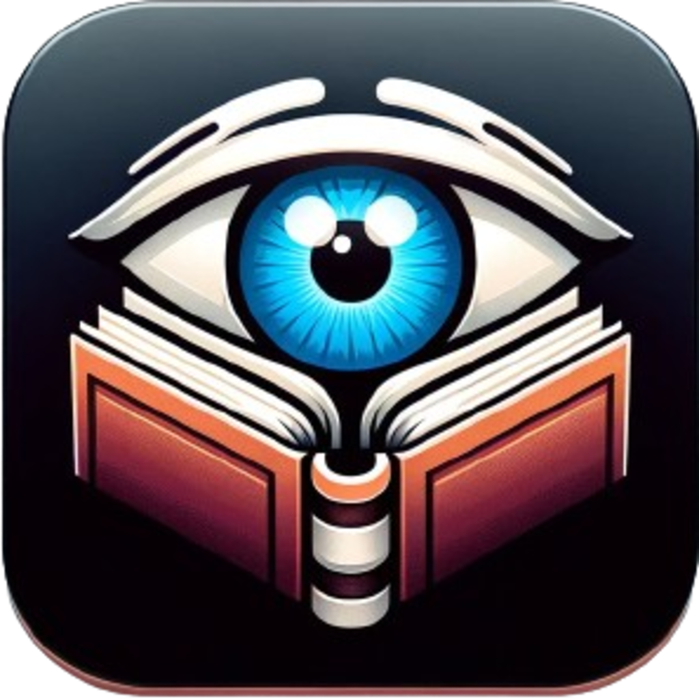

# GestuRead




## Description
GestuRead allows you reading digital books with navigation controlled by facial gestures and head movements.

## Features
- **Facial Gesture Page Control**: Navigate through pages by turning your head left or right.
- **Eyebrow Raise Bookmarking**: Mark pages by raising your eyebrows.
- **Eye Tracking**: Move through pages by looking at different screen regions.
- **Accessibility Focused**: Designed to improve accessibility for users with motor disabilities.

## Installation
To run this project, clone the repo, and open the project in Xcode:

```bash
git clone https://github.com/jcordon5/GestuRead.git
```

## Usage
1. **Launch the App**: Open the app on a compatible iPhone with Face ID capability.
2. **Select a Book**: Use the button on the first view to load a digital book.
3. **Read & Navigate**: Turn pages using head movements or eye tracking. Raise your eyebrows to bookmark a page.
4. **Bookmarking**: The app remembers your last read page and bookmark.

## Contributing
Pull requests are welcome. For major changes, please open an issue first to discuss what you would like to change.
